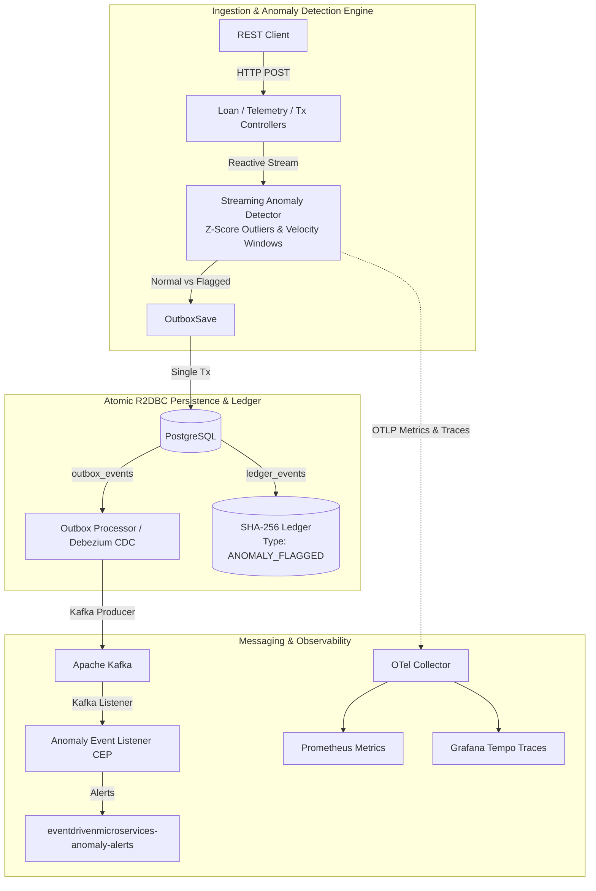

# Event-Driven Microservices Lab

## Project Documentation

- **[System Architecture Specification](docs/architecture.md)**: Deep dive into service topology, non-blocking I/O, outbox dual-writes, and W3C trace propagation.
- **[Engineering Roadmap & Refactoring](docs/codebase-analysis-refactoring-steps.md)**: Current capability matrix and phased implementation milestones.
- **[Architecture Verdict & Decisions (ADRs)](docs/Verdict.md)**: Design rationale, consistency models, and modular monolith vs microservices analysis.
- **[Testing Strategy & Quality Engineering](docs/testing.md)**: Multi-layer testing pyramid (ArchUnit, WebFlux slices, Testcontainers, and end-to-end workflows).
- **[Developer & Codespaces Guide](docs/codespaces.md)**: Local developer setup, cloud container environment, and CLI reference.

A hands-on engineering lab demonstrating event-driven distributed systems architecture, reactive streaming anomaly detection, PostgreSQL Transactional Outbox, Apache Kafka event streaming, and Kubernetes deployment.


## 🏛️ System Architecture



### Core Components

1. **`apps/platform-engine` (Java 21 / Spring Boot 3 / WebFlux / R2DBC)**:
   - Non-blocking reactive HTTP ingestion API.
   - **Streaming Anomaly Detection Engine**: In-memory sliding window calculating transaction velocity bursts and telemetry Z-Score metric outliers.
   - **Transactional Outbox Pattern**: Persists domain entities (`loan_applications`, `telemetry_events`, `financial_transactions`) alongside `outbox_events` and append-only cryptographic `ledger_events` using PostgreSQL R2DBC.
  - **Kafka CEP Listener**: Consumes CDC outbox events from Kafka and routes enriched anomaly alerts to `eventdrivenmicroservices-anomaly-alerts`.

2. **`deploy/helm`**:
   - Helm chart packaging the platform-engine alongside infrastructure services (Kafka, Zookeeper, PostgreSQL, Redis, OpenTelemetry Collector, Prometheus, Grafana, Tempo, Loki).
   - Configured with security contexts, init containers, and HPA for production-like deployment on local `kind` clusters.

---

## 🛠️ Key Architectural Patterns Demonstrated

- **Streaming Anomaly Detection**:
  - **Financial Velocity Anomaly**: Detects rapid high-value transactions from the same account within a sliding temporal window ($> \$10,000$ in 5s or $>5$ tx/s).
  - **Telemetry Z-Score Outlier**: Computes rolling mean ($\mu$) and standard deviation ($\sigma$) to flag statistical outliers ($Z = \frac{|x-\mu|}{\sigma} > 3.0$).
- **Transactional Outbox Pattern**: Enforces dual-write consistency by persisting business state and event records in a single database transaction prior to asynchronous Kafka publishing.
- **Reactive Non-Blocking Core**: Built on Spring WebFlux, Project Reactor, and R2DBC to maximize vertical I/O throughput without thread-per-request bottlenecks.
- **Cryptographic Ledger**: SHA-256 hash-chained append-only `ledger_events` table for tamper-evident transaction history.
- **Debezium CDC**: Write-Ahead Log streaming from PostgreSQL into Kafka for zero-latency outbox event delivery alongside the Spring scheduled polling fallback.
- **Distributed Tracing & Monitoring**: OpenTelemetry (OTLP) metrics and trace exemplars routed to Prometheus and Grafana Tempo via the OTel Collector.
- **Kubernetes Deployment Hardening**: Security contexts (non-root, read-only filesystem), init containers for dependency readiness, and HPA autoscaling.

---

## 🚀 Quick Start & Centralized Harness

### Prerequisites
- Java 21 & Gradle 8.4
- Helm 3+ & kubectl
- Kind & OpenTofu/Terraform
- Docker or Podman (for local cluster execution)

### Centralized Build & Boot Script

Run the single entry-point script to validate the toolchain, execute the Java unit/contract test suite, provision the local Kind cluster, and deploy all infrastructure dependencies and services via Helm:

```bash
./scripts/start-all.sh
```

*(On Windows PowerShell, use `./scripts/start-all.ps1`)*

### Accessing & Testing the Platform

1. **Port-Forward the Platform Control Room UI & REST API**:
   ```bash
   kubectl port-forward svc/platform-engine 8080:8080
   ```
   Navigate to `http://localhost:8080/` in your browser. Log in with `admin` / `local-dev-password` to use the interactive loan, transaction, telemetry, outbox, and ledger control room.

2. **Port-Forward the Grafana Observability Dashboard**:
   ```bash
   kubectl port-forward svc/eventdrivenmicroservices-grafana 3000:3000
   ```
   Navigate to `http://localhost:3000` to inspect live application metrics, anomaly rate histograms, and trace exemplars.

3. **Execute the Automated Five-Minute Demo**:
   ```bash
   ./scripts/demo.sh
   ```

---

## 🧪 Testing

- **Java Unit & Anomaly Tests**:
  ```bash
  cd apps/platform-engine
  ./gradlew test
  ```
  *(Includes unit tests for `StreamingAnomalyDetectorTest`, ArchUnit tests verifying non-blocking invariants, and Testcontainers-based E2E integration tests.)*

## Five-Minute Demo

Start the application locally or port-forward the deployed service to `localhost:8080`, then run:

```powershell
./scripts/demo.ps1
```

On Bash-compatible systems:

```bash
./scripts/demo.sh
```

The demo submits a loan, sends a normal transaction, sends a six-transaction velocity burst, and reads the outbox backlog plus ledger hash evidence. It does not provision infrastructure; use `scripts/test-local.ps1` or `scripts/test-local.sh` first when running against Kind.

The browser control room is available at `http://localhost:8080/` when the application is running. Enter the operator credentials, submit a loan, send a transaction burst, establish a telemetry baseline, inject a CPU outlier, and refresh the evidence panel to inspect the current ledger and outbox state. Each API response exposes `X-Correlation-Id` and, when an active span exists, `X-Trace-Id`.

---

## 📦 Tech Stack

| Technology | Role |
|---|---|
| Java 21 | Application runtime |
| Spring Boot 3 (WebFlux) | Reactive REST framework |
| PostgreSQL 15 (R2DBC) | Primary data store + Outbox + Ledger |
| Apache Kafka | Event streaming broker & CEP listener |
| Debezium | CDC connector for WAL-based outbox |
| Redis | Distributed caching and idempotency |
| Kubernetes (kind) | Container orchestration |
| Helm 3 | Kubernetes package management |
| Terraform | Infrastructure provisioning |
| Prometheus | Metrics collection & anomaly alerting |
| Grafana + Tempo + Loki | Dashboards, tracing, and log aggregation |
| OpenTelemetry | Distributed observability pipeline |
