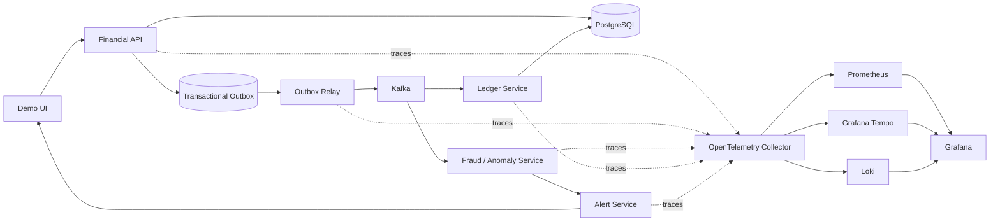

# EventDrivenMicroservices Architecture Verdict

**Date:** September 14, 2026
**Scope:** Codebase, documentation, Phase 0 foundation, target microservice architecture, UI, mock financial workflow, testing, and observability.

## Verdict

The repository has a credible Phase 0 foundation, but the documentation and implementation are not fully coherent yet.

### Implemented today

- One deployable reactive Spring Boot service: `platform-engine`.
- REST ingestion for loans, transactions, and telemetry.
- PostgreSQL/R2DBC persistence.
- Transactional outbox persistence.
- Kafka publishing and anomaly listener.
- Redis-backed anomaly detection with in-memory fallback.
- SHA-256 ledger append logic.
- Helm, Kind/Terraform, CI, Prometheus, Grafana, Tempo, Loki, and OpenTelemetry Collector manifests.
- Java 21 / Gradle 8.4 build.

### Missing or overstated

- No application UI exists.
- No mock financial provider exists.
- No ledger query API exists, despite `docs/master_plan.md` describing one.
- Full HTTP -> PostgreSQL -> outbox -> Kafka -> anomaly -> ledger trace correlation is not implemented.
- Kafka trace headers are not propagated.
- Debezium is configured but connector registration and verified CDC delivery are missing.
- Grafana has Prometheus provisioning, but Tempo and Loki datasources are missing.
- Tempo is deployed without the referenced configuration file.
- CI image naming does not fully align with Helm image naming.
- `OutboxProcessorService` uses detached `subscribe()` and lacks event claiming/idempotency.
- `docs/architecture.md` contains stale project identifiers and old OTLP claims.
- `docs/master_plan.md` is substantially historical and should not remain an authoritative implementation plan.

`docs/rebuild_guide.md` is currently the most reliable planning document and should remain the canonical rebuild plan.

## Recommended Architecture

Do not split the existing application immediately. First make it a demonstrable modular monolith, then extract services when boundaries are proven.



## Service Boundaries

### Financial API

- Loan submission.
- Transaction ingestion.
- Telemetry ingestion.
- Authentication.
- Transactional database writes.
- Outbox creation.

### Outbox Relay

- Claims pending outbox records.
- Publishes Kafka events.
- Records success, failure, and retry state.
- Propagates W3C trace context in Kafka headers.

### Fraud / Anomaly Service

- Velocity detection.
- Telemetry Z-score detection.
- Redis state.
- Anomaly metrics.
- Anomaly event publication.

### Ledger Service

- Append-only ledger writes.
- Chain verification.
- Ledger query API.
- Integrity status endpoint.

### Alert Service

- Consumes anomaly events.
- Stores alert state.
- Exposes a live alert feed to the UI.

### Demo UI

- Submit a loan.
- Send a transaction.
- Trigger a transaction burst.
- Send telemetry baseline and outlier values.
- View anomaly results.
- View the ledger chain.
- Display correlation and trace IDs.
- Show outbox delivery status.

## Flask Decision

Do not introduce Flask for the core business system. Duplicating the Java platform in Flask would increase operational complexity.

Use Python/Flask only for an optional mock external provider:

```text
apps/mock-financial-provider/
  app.py
  routes/
    payments.py
    settlements.py
  tracing/
    otel.py
```

The mock provider can simulate payment approval, payment decline, settlement delay, provider timeout, duplicate responses, and provider errors. The Java Financial API should call it through an adapter so retries, trace propagation, and failure behavior are demonstrable.

## Recommended Repository Structure

```text
apps/
  platform-engine/
    src/main/java/com/eventdrivenmicroservices/platform/
      api/
        LoanController.java
        TransactionController.java
        TelemetryController.java
        LedgerController.java
        AnomalyController.java
        OutboxController.java
      application/
        loan/
        transaction/
        telemetry/
        payment/
      domain/
        loan/
        transaction/
        ledger/
        anomaly/
      infrastructure/
        postgres/
        redis/
        kafka/
        outbox/
        observability/
        security/
      config/
    src/test/
      unit/
      integration/
      architecture/

  web-ui/
    src/
      features/
        loan-origination/
        payment-simulation/
        anomaly-monitor/
        ledger-explorer/
        trace-explorer/
      shared/
        api/
        correlation/
        components/

  mock-financial-provider/
    app/
      routes/
      services/
      tracing/
    tests/

  contracts/
    events/
      loan-submitted.v1.json
      transaction-created.v1.json
      payment-requested.v1.json
      payment-result.v1.json
      anomaly-detected.v1.json
      ledger-appended.v1.json
    http/

deploy/
  helm/
    event-driven-lab/
  dashboards/
    grafana/
    prometheus/
  connectors/
    debezium/
  docker-compose/
    observability.yml

tests/
  contract/
  integration/
  e2e/
  observability/
  failure-scenarios/

scripts/
  demo.ps1
  demo.sh
  verify-trace.ps1
  verify-trace.sh
  health-check.ps1
  health-check.sh
```

## Event Contract

Every event should use a shared envelope:

```json
{
  "eventId": "uuid",
  "eventType": "TransactionCreated",
  "eventVersion": 1,
  "aggregateType": "FinancialTransaction",
  "aggregateId": "uuid",
  "correlationId": "uuid",
  "traceId": "trace-id",
  "causationId": "event-id",
  "occurredAt": "2026-09-14T12:00:00Z",
  "payload": {}
}
```

W3C propagation must occur through:

- HTTP `traceparent`.
- Database/outbox metadata.
- Kafka `traceparent` headers.
- Consumer extraction.
- Child spans in anomaly, ledger, and alert processing.

At present, the code stores some `traceparent` data in the outbox but does not complete this chain.

## Demonstration Workflow

The primary demo should be:

1. Open the Demo UI.
2. Submit a loan application.
3. Submit a normal payment.
4. Trigger six transactions for one merchant.
5. Show the velocity anomaly.
6. Send telemetry baseline values followed by an outlier.
7. Show the anomaly alert in the UI.
8. Open the ledger chain and show SHA-256 linkage.
9. Display the correlation ID and trace ID.
10. Open Grafana and follow the same trace in Tempo.
11. Show outbox delivery latency and Kafka consumer activity.

This creates one coherent portfolio story instead of disconnected technical features.

## Observability Design

Use Grafana Tempo as the primary trace backend. Jaeger should be optional rather than deployed alongside Tempo by default.

### Business Flow Dashboard

- Loans submitted.
- Transactions accepted.
- Payments approved and declined.
- Anomalies detected.
- Alerts generated.
- Ledger append success and failure.

### Outbox Reliability Dashboard

- Pending event count.
- Oldest pending event age.
- Publish success and failure count.
- Retry count.
- Outbox-to-Kafka latency.
- Duplicate delivery count.

### Kafka Health Dashboard

- Consumer lag.
- Producer errors.
- Publish throughput.
- Consumer processing latency.

### Application Runtime Dashboard

- HTTP rate.
- HTTP error rate.
- P95/P99 latency.
- JVM memory.
- CPU.
- Restarts.
- Database pool saturation.

### Trace Explorer

- Links from UI correlation IDs to Tempo.
- HTTP -> database -> outbox -> Kafka -> anomaly -> ledger span chain.

### Security and Compliance Dashboard

- Authentication failures.
- JWT validation failures.
- Ledger integrity failures.
- Retention purge counts.
- Secret/configuration errors.

## Documentation Structure

```text
README.md

docs/
  rebuild_guide.md        # canonical execution plan
  Verdict.md              # this architecture verdict
  architecture.md         # current architecture only
  master_plan.md          # portfolio and learning roadmap only
  demo.md                 # five-minute business workflow
  observability.md        # dashboards and trace correlation
  api.md                  # HTTP contracts
  events.md               # Kafka contracts
  testing.md              # test layers and commands
  failure-scenarios.md    # infrastructure and provider failures
  security.md             # secrets and runtime hardening
```

`master_plan.md` should be rewritten as a portfolio and learning roadmap. It must stop claiming deleted files, old identifiers, nonexistent APIs, and completed capabilities that are only planned.

## Staged Implementation Order

### Stage 1: Documentation and baseline truth

- Rewrite `architecture.md`.
- Rewrite `master_plan.md`.
- Add an implemented/missing capability matrix to `rebuild_guide.md`.
- Remove claims about nonexistent ledger endpoints and complete trace propagation.

### Stage 2: Make the current monolith demonstrable

- Add ledger, anomaly, outbox, and health query APIs.
- Add `scripts/demo.ps1` and `scripts/demo.sh`.
- Fix Helm image naming.
- Add a local mock payment provider.
- Add correlation IDs to all responses and events.

### Stage 3: Complete observability

- Add Kafka producer and consumer tracing.
- Add database and outbox spans.
- Add Tempo and Loki Grafana datasources.
- Add a real Tempo configuration.
- Add dashboards for business flow, outbox, Kafka, runtime, and security.
- Verify one trace end to end.

### Stage 4: UI

Build the UI after read APIs exist. The UI should consume the Java API and show business state, not directly query Kafka or PostgreSQL.

### Stage 5: Extract services

Extract in this order:

1. `financial-api`
2. `outbox-relay`
3. `fraud-service`
4. `ledger-service`
5. `alert-service`

Each service must have an independent Dockerfile, Helm Deployment, readiness/liveness probes, metrics, logs, trace service name, unit tests, integration tests, contract tests, and failure scenario.

## Acceptance Criteria

The project should not claim final completion until these are true:

- One demo command or UI workflow creates a loan and payment activity.
- An anomaly is deterministically triggered.
- The event reaches Kafka.
- The anomaly service consumes it.
- The ledger records it.
- The UI displays the result.
- The same trace ID is visible across HTTP, database, Kafka, anomaly, ledger, and alert processing.
- Grafana displays the relevant metrics.
- Tempo displays the full trace.
- A failure scenario demonstrates retry or recovery.
- The workflow passes locally and in Codespaces.
- Unit, integration, contract, end-to-end, observability, and Helm tests pass.

The immediate architectural recommendation is to remain a modular monolith through the demonstrable workflow and observability stages. Extracting independent microservices before that proof exists would create more deployment surface without improving the core demonstration.
