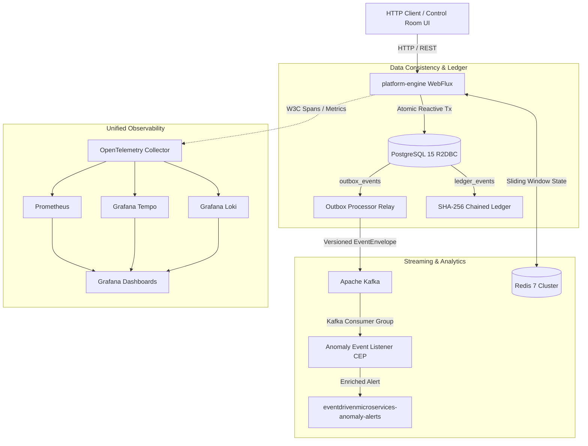

# EventDrivenMicroservices System Architecture

**Status:** Official System Architecture Specification  
**Version:** 2.0  
**Related Documents:** [codebase-analysis-refactoring-steps.md](codebase-analysis-refactoring-steps.md), [Verdict.md](Verdict.md), [testing.md](testing.md)

---

## 1. System Topology

The platform operates as an observable modular monolith deployed to Kubernetes via Helm. All core financial ingestion, outbox dispatch, stream processing, anomaly detection, and cryptographic ledgering run within `platform-engine`, backed by PostgreSQL, Redis, and Apache Kafka.



---

## 2. Ingestion & API Layer

The HTTP layer is non-blocking, built with Spring WebFlux and secured with HTTP Basic and JWT Bearer authentication.

* `POST /api/v1/loans`: Ingests loan origination applications, validates applicant UUIDs and dynamic loan tier properties, persists the loan, creates an outbox event, and appends an `ApplicationSubmitted` record to the SHA-256 ledger.
* `POST /api/v1/transactions`: Ingests financial transactions, evaluates real-time sliding-window velocity thresholds, and dual-writes transaction state with outbox events.
* `POST /api/v1/telemetry`: High-throughput telemetry ingestion evaluating rolling Z-score outliers ($Z > 3.0$).
* `GET /api/v1/ledger`: Retrieves chronological ledger event history with hash proofs.
* `GET /api/v1/ledger/latest-hash`: Exposes the latest cryptographic head of the SHA-256 chain.
* `GET /api/v1/outbox/status`: Returns current outbox backlog depth, oldest unprocessed record timestamp, and queue age.
* `GET /`: Interactive web control room serving static WebFlux resources for operators and live demos.

### Context Propagation
Every HTTP response includes an `X-Correlation-Id` header (generated or preserved from client requests) and an `X-Trace-Id` header whenever an active OpenTelemetry trace span exists.

---

## 3. Transactional Outbox Pattern

To ensure zero event loss without distributed two-phase commit overhead:
1. **Atomic Dual-Write:** The business entity and the corresponding outbox record are committed together in a single PostgreSQL R2DBC transaction.
2. **Resilient Outbox Relay:** A scheduled background publisher queries pending events using batch limiting (`.take(50)`), sequential publishing (`.concatMap`), and per-event error isolation (`.onErrorResume`).
3. **Kafka Header Injection:** The stored W3C `traceparent` is injected into the Kafka record header so downstream consumers maintain causal trace continuity.
4. **Contract Envelope:** Payloads are serialized using the standardized `EventEnvelope` schema:
   ```json
   {
     "eventId": "uuid",
     "eventType": "ApplicationSubmitted",
     "schemaVersion": 1,
     "aggregateType": "LoanApplication",
     "aggregateId": "11111111-1111-4111-8111-111111111111",
     "traceparent": "00-4bf92f3577b34da6a3ce929d0e0e4736-00f067aa0ba902b7-01",
     "createdAt": "2026-09-14T19:11:00.437Z",
     "payload": "{...}"
   }
   ```

---

## 4. Cryptographic Ledgering

The ledger enforces verifiable immutability for critical domain operations and anomaly events:
* **Genesis Hash:** Rooted at deterministic `64-zero` SHA-256 string (`0000000000000000000000000000000000000000000000000000000000000000`).
* **Hash Chaining:** Each record calculates:
  $$\text{current\_hash} = \text{SHA-256}(\text{previous\_hash} + \text{transaction\_type} + \text{payload})$$
* **Tamper Evidence:** Modifying any historical record invalidates all subsequent hashes in the chain, enabling instant detection via automated audit scripts.

---

## 5. Streaming Anomaly Detection Engine

The anomaly detection engine runs in-process with dual-backend state management:
* **Financial Velocity Anomaly:** Detects rapid transactions exceeding either \$10,000 or 5 transactions within a rolling 5-second sliding window. State is managed via Redis Sorted Sets (with an automatic in-memory concurrent deque fallback).
* **Telemetry Z-Score Outlier:** Calculates rolling mean ($\mu$) and standard deviation ($\sigma$) across a window of 20 readings, flagging any observation where:
  $$Z = \frac{|x - \mu|}{\sigma} \ge 3.0$$
* **Complex Event Processing:** When an anomaly is detected, the event is appended to the cryptographic ledger as `ANOMALY_FLAGGED`, dispatched to Kafka, and consumed by `AnomalyEventListener` to route high-priority alerts to `eventdrivenmicroservices-anomaly-alerts`.

---

## 6. Observability & Infrastructure

The production stack is packaged in the canonical Helm chart `deploy/helm/event-driven-lab`:
* **OpenTelemetry Collector:** Central gateway receiving OTLP gRPC/HTTP signals on ports 4317 and 4318.
* **Grafana Tempo:** Distributed trace storage supporting traceparent lookups.
* **Prometheus:** Metrics scraping endpoint monitoring throughput, JVM metrics, and custom anomaly counters.
* **Grafana Loki:** Centralized log aggregation across all Kubernetes pods.
* **Grafana:** Dashboards pre-provisioned with Prometheus, Tempo, and Loki datasources.
* **Security Hardening:** Pods execute with restricted security contexts (`allowPrivilegeEscalation: false`, non-root execution, dropped capabilities). All secrets are injected dynamically from Kubernetes Secrets (`eventdrivenmicroservices-secrets`).
