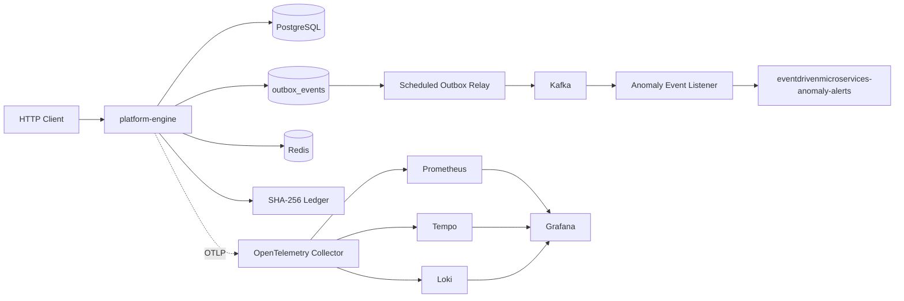

# EventDrivenMicroservices Architecture

**Status:** Current implementation baseline
**Canonical plan:** [rebuild_guide.md](rebuild_guide.md)
**Refactoring playbook:** [codebase-analysis-refactoring-steps.md](codebase-analysis-refactoring-steps.md)

## Current Topology

The current system is a modular-monolith baseline: one Spring Boot WebFlux application plus infrastructure dependencies deployed by Helm.



## Implemented Boundaries

### HTTP ingestion

- `POST /api/v1/loans`
- `POST /api/v1/transactions`
- `POST /api/v1/telemetry`
- `GET /api/v1/ledger`
- `GET /api/v1/ledger/latest-hash`
- `GET /api/v1/outbox/status`

The application serves a lightweight business control room at `/`. The static shell is public, while its API requests use operator Basic authentication.

Every response receives an `X-Correlation-Id`; responses with an active OpenTelemetry span also receive `X-Trace-Id`. The control room displays the latest values so a demo request can be followed into application logs and the trace backend.

### Persistence

PostgreSQL stores loan applications, financial transactions, telemetry events, outbox events, and ledger events through R2DBC repositories and Flyway migrations.

### Event delivery

The application currently has a scheduled outbox publisher that sends `eventdrivenmicroservices-outbox-events` to Kafka. Debezium connector configuration exists in Helm, but connector registration and end-to-end CDC evidence are still pending.

### Anomaly detection

The detector supports financial velocity and telemetry Z-score checks with Redis state and an in-memory fallback. Anomaly events are routed to `eventdrivenmicroservices-anomaly-alerts`.

### Ledger

The ledger appends SHA-256 hash-linked events. A read/query API and database-level append-only enforcement are future work.

## Current Package Direction

The first boundary moves are complete: HTTP controllers and their tests now live under `api`, orchestration services and their tests now live under `application`, and PostgreSQL, Redis, Kafka, outbox, and observability adapters now live under `infrastructure`. The deployment topology is unchanged:

```text
com.eventdrivenmicroservices.platform
├── api
│   ├── loan
│   ├── transaction
│   ├── telemetry
│   ├── anomaly
│   ├── ledger
│   └── outbox
├── application
│   ├── loan
│   ├── transaction
│   ├── telemetry
│   └── payment
├── domain
│   ├── loan
│   ├── transaction
│   ├── anomaly
│   └── ledger
├── infrastructure
│   ├── postgres
│   ├── redis
│   ├── kafka
│   ├── outbox
│   └── observability
├── security
└── config
```

This is an internal modularization step, not yet a microservice split.

## Target Evolution

After the demonstrable workflow is stable, extract services in this order:

1. `financial-api`
2. `outbox-relay`
3. `fraud-service`
4. `ledger-service`
5. `alert-service`

Each extraction requires an independent contract, deployment, health checks, metrics, traces, tests, and failure scenario.

## Observability Contract

The target workflow must correlate one request across:

```text
HTTP ingress
  -> validation
  -> PostgreSQL domain write
  -> outbox write
  -> Kafka publish
  -> anomaly evaluation
  -> ledger append
  -> alert publication
```

The implementation propagates the stored W3C `traceparent` from outbox metadata into Kafka headers, extracts it in the anomaly consumer, and forwards it to alert messages. Full child-span creation and end-to-end trace verification remain pending. Grafana Tempo is the default trace backend; Jaeger is optional and should not run alongside Tempo by default.

Kafka payloads are published with a versioned `EventEnvelope` containing event ID, event type/version, aggregate metadata, traceparent, occurrence time, and the original business payload.

## Known Gaps

- No mock financial provider exists yet (planned as optional Flask mock dependency in Stage 5).
- Outbox processing has no claim/lease or idempotency mechanism (in progress in Stage 2).
- Grafana Tempo and Loki datasources/configuration require full runtime validation.
- Full local Kind runtime deployment evidence is pending.

Implemented in current baseline:
- Lightweight WebFlux control room UI served at `/`.
- Authenticated Ledger and Outbox read/status APIs (`/api/v1/ledger`, `/api/v1/ledger/latest-hash`, `/api/v1/outbox/status`).
- W3C `traceparent` propagation from outbox into Kafka headers and anomaly alert routing.
- `X-Correlation-Id` response header filter and active span `X-Trace-Id` exposure.

These items align with [codebase-analysis-refactoring-steps.md](codebase-analysis-refactoring-steps.md) and [Verdict.md](Verdict.md).
