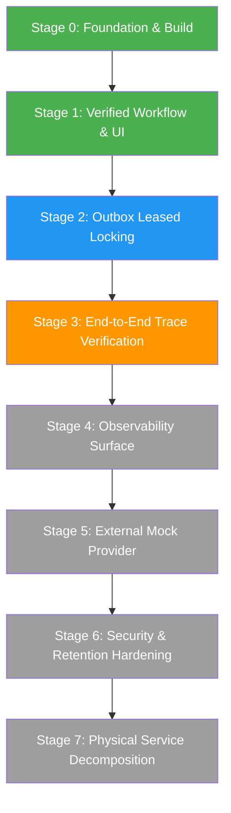

# EventDrivenMicroservices Engineering Roadmap & Refactoring Specification

**Status:** Official Implementation Roadmap  
**Date:** September 2026  
**Related Documents:** [architecture.md](architecture.md), [Verdict.md](Verdict.md), [testing.md](testing.md), [README.md](../README.md)

---

## 1. Architectural Strategy

The project follows a disciplined engineering strategy:
> **Stabilize one complete, observable business workflow in a modular monolith before extracting independent microservices.**

This ensures that data ownership, event schemas, transactional boundaries, and observability propagation are fully verified before introducing network boundaries and distributed deployment overhead.

---

## 2. Implemented Capabilities & Verified Baseline

### 2.1 Backend Core (`apps/platform-engine`)
* **Framework:** Java 21, Spring Boot 3.2.5, Spring WebFlux, Project Reactor.
* **Reactive Persistence:** PostgreSQL R2DBC repositories with Flyway schema migration `V1__Initial_Schema.sql`.
* **Layered Package Architecture:** Clean feature boundaries established across `api`, `application`, `domain`, `infrastructure`, and `security`.
* **Non-Blocking Architecture:** ArchUnit tests enforce non-blocking execution (zero `Thread.sleep` and zero `java.sql` dependencies in `api`/`application` layers).

### 2.2 Event Streaming & Outbox Resilience
* **Transactional Outbox:** Dual-write persistence for domain entities and outbox events within a single reactive database transaction.
* **Resilient Outbox Processor:** Batch-capped (`.take(50)`), sequential publishing (`.concatMap`), and per-event error isolation (`.onErrorResume`). Broker connection failures on individual messages never abort subsequent batches or mark failed records as processed.
* **Contract Versioning:** Kafka messages are serialized using the versioned `EventEnvelope` format (`eventId`, `eventType`, `schemaVersion`, `aggregateType`, `aggregateId`, `traceparent`, `createdAt`, `payload`).

### 2.3 Cryptographic Ledger & Anomaly Detection
* **Tamper-Evident Ledger:** Append-only SHA-256 hash chaining rooted at a deterministic genesis block. Every state change links to the hash of the preceding entry.
* **Streaming Anomaly Engine:** In-memory sliding window with Redis cluster capability detecting financial velocity spikes ($> \$10,000$ in 5s or $>5$ tx/s) and telemetry Z-score statistical outliers ($Z > 3.0$).
* **Complex Event Processing (CEP):** Kafka listener evaluates consumed outbox events and routes enriched alerts to `eventdrivenmicroservices-anomaly-alerts`.

### 2.4 Observability & Context Propagation
* **Trace Propagation:** W3C `traceparent` headers are extracted at the HTTP boundary, stored with outbox records, injected into Kafka record headers, and forwarded to downstream anomaly alerts.
* **Correlation Layer:** `CorrelationIdWebFilter` generates or preserves `X-Correlation-Id` and exposes active `X-Trace-Id` on all HTTP responses.
* **Telemetry Pipeline:** OpenTelemetry Collector routes metrics to Prometheus, traces to Grafana Tempo, and logs to Grafana Loki. Pre-configured Grafana dashboards display real-time anomaly rates, telemetry Z-scores, and HTTP throughput.

### 2.5 Infrastructure & Automation
* **Container Environment:** Multi-stage Dockerfile (`eclipse-temurin:21-jre-alpine`) running unprivileged (`spring:spring`).
* **Local Cluster Orchestration:** Automated provisioning of multi-node Kind clusters via OpenTofu/Terraform (`terraform/environments/local/main.tf`).
* **Canonical Helm Chart:** Complete production-grade Helm deployment (`deploy/helm/event-driven-lab`) with security contexts, init containers, probes, and HPA.
* **Centralized Harness:** Single-entrypoint script (`scripts/start-all.sh`) for toolchain validation, test execution, container image building, cluster provisioning, and Helm installation.

---

## 3. Phased Implementation Roadmap



### Stage 0: Foundation & Toolchain (Status: COMPLETE)
* Java 21 compilation and test toolchain verification.
* Helm chart linting and template generation.
* Docker-in-Docker and Kind provisioning validation.
* **Exit Gate:** Clean build, test suite execution, and Helm linting pass.

### Stage 1: Verified Workflow & Control Room (Status: COMPLETE)
* WebFlux static control room UI served at `http://localhost:8080/`.
* Read APIs for Ledger (`/api/v1/ledger`, `/api/v1/ledger/latest-hash`) and Outbox (`/api/v1/outbox/status`).
* Deterministic demo script (`scripts/demo.sh`) exercising loan submission, transaction bursts, outbox queueing, and SHA-256 ledger verification.
* **Exit Gate:** Single command `./scripts/demo.sh` produces demonstrable persistence, anomaly detection, and ledger chaining.

### Stage 2: Outbox Leased Locking (Status: IN PROGRESS)
* Introduce database-level row locking (`SELECT ... FOR UPDATE SKIP LOCKED`) on pending outbox polling to support horizontal scaling across multiple application replicas.
* Track retry count and last error metadata on outbox records.
* Verify Kafka unavailable failure injection and retry behavior.
* **Exit Gate:** Outbox processing test proves multiple worker nodes claim non-overlapping event batches without duplicate publishing.

### Stage 3: End-to-End Distributed Trace Verification (Status: SCHEDULED)
* Validate active OpenTelemetry span injection across all R2DBC queries, outbox dispatches, and Kafka consumer records.
* Verify end-to-end trace waterfall visibility in Grafana Tempo linking HTTP ingress $\rightarrow$ PostgreSQL $\rightarrow$ Outbox $\rightarrow$ Kafka $\rightarrow$ Anomaly $\rightarrow$ Ledger.
* **Exit Gate:** Querying a trace ID in Grafana Tempo displays the complete multi-hop causal chain.

### Stage 4: Observability Surface & Alerting (Status: SCHEDULED)
* Configure Prometheus alerting rules for outbox backlog growth ($> 1000$ records) and Kafka publication failure rates.
* Add Grafana dashboard panels for outbox relay latency and Redis fallback metrics.
* **Exit Gate:** Controlled broker disconnect triggers visible alerts in Grafana and Prometheus Alertmanager.

### Stage 5: External Dependency Simulation (Status: SCHEDULED)
* Scaffold `apps/mock-financial-provider` in Python/Flask to simulate external payment gateway interactions.
* Implement test scenarios for payment approval, decline, timeout, and delayed settlement.
* **Exit Gate:** Platform Engine handles external provider timeouts and retries while preserving correlation IDs.

### Stage 6: Security & Data Lifecycle Hardening (Status: SCHEDULED)
* Implement automated telemetry partition lifecycle migrations (rolling partition creation and historical drop).
* Enforce constant-time HMAC comparison and strict JWT secret validation on startup.
* **Exit Gate:** Forward partition creation and expired partition purges execute deterministically in PostgreSQL.

### Stage 7: Physical Service Decomposition (Status: FUTURE ROADMAP)
* Extract modular monolith packages into independently deployable microservice containers:
  1. `financial-api` (HTTP Ingress, Loan & Transaction validation)
  2. `outbox-relay` (Transactional Outbox poller and Kafka publisher)
  3. `fraud-service` (Streaming anomaly detection and Redis state)
  4. `ledger-service` (Append-only SHA-256 cryptographic ledger)
  5. `alert-service` (Kafka CEP listener and alert notification feed)
* **Exit Gate:** Each service operates with dedicated Helm charts, independent CI pipelines, and versioned event contracts.
4. Add a lightweight UI served by Spring WebFlux static resources.
5. Add correlation ID to responses and displayed results.
6. Update `README.md` with a five-minute demo path.

### Exit gate

A new user can run one documented command, submit a request, trigger an anomaly, and see the resulting ledger state without reading the implementation first.

## Stage 2: Stabilize the Outbox

### Goal

Make the core event-driven claim reliable and measurable.

### Steps

1. Introduce an event envelope with event ID, type, version, aggregate ID, correlation ID, trace ID, causation ID, and timestamp.
2. Add claiming or leasing for pending outbox records.
3. Prevent concurrent duplicate processing.
4. Add retry count and last-error fields.
5. Add publish success, failure, retry, backlog, age, and latency metrics.
6. Test Kafka unavailable, publish failure, retry, and duplicate delivery.
7. Decide whether the initial demo uses the scheduled relay or Debezium as the primary path.
8. Do not claim both delivery mechanisms are active until both are verified.

### Exit gate

An outbox integration test proves that domain persistence and event persistence are atomic, failed publication is retried, and duplicate delivery does not duplicate ledger effects.

## Stage 3: Complete Trace Correlation

### Goal

Make one business request followable across every important hop.

### Steps

1. Extract W3C trace context from HTTP headers.
2. Create application spans for validation and business decisions.
3. Add database spans for domain and outbox writes.
4. Inject W3C trace context into Kafka headers.
5. Extract context in Kafka consumers.
6. Add anomaly, ledger, and alert child spans.
7. Store correlation ID and trace ID in event metadata.
8. Return correlation ID and trace ID from demo-facing APIs.

### Exit gate

A single request produces one trace visible in Tempo containing HTTP, PostgreSQL, outbox, Kafka, anomaly, ledger, and alert spans.

## Stage 4: Finish the Observability Surface

### Goal

Turn infrastructure into evidence for the business workflow.

### Dashboards

1. Business flow.
2. Outbox reliability.
3. Kafka health.
4. Application runtime.
5. Security and compliance.
6. Trace exploration.

### Steps

1. Add Tempo and Loki Grafana datasources.
2. Add and validate Tempo configuration.
3. Align dashboard queries with emitted metric names.
4. Add outbox backlog and latency metrics.
5. Add anomaly counters by type.
6. Add ledger integrity and append failure metrics.
7. Add alert rules for failed publication, growing backlog, and dependency failure.

### Exit gate

The demo UI and Grafana dashboards show the same request, event, anomaly, and ledger outcome from different operational perspectives.

## Stage 5: Add the Mock Financial Provider

### Goal

Demonstrate a realistic external dependency and failure handling.

### Structure

```text
apps/mock-financial-provider/
├── app.py
├── routes/
│   ├── payments.py
│   └── settlements.py
├── services/
├── tracing/
└── tests/
```

### Scenarios

- Payment approved.
- Payment declined.
- Provider timeout.
- Delayed settlement.
- Duplicate response.
- Provider unavailable.

### Exit gate

The Java application handles provider success and failure while preserving correlation IDs and trace continuity.

## Stage 6: Harden the Database and Security Boundaries

### Database

1. Add ledger query and verification support.
2. Add database-level append-only enforcement where required.
3. Add forward-only telemetry partition lifecycle migrations.
4. Verify retention boundaries.
5. Add repository tests against PostgreSQL.

### Security

1. Add valid, invalid, expired, malformed, and missing JWT tests.
2. Use constant-time HMAC comparison.
3. Make missing production secrets fail startup.
4. Verify actuator role protection.
5. Verify no secrets exist in source, examples, Helm templates, or demo output.

### Exit gate

Security and data lifecycle behavior is tested, documented, and observable.

## Stage 7: Extract Services Carefully

Extract only after Stages 1 through 6 are stable.

Recommended order:

1. `financial-api`
2. `outbox-relay`
3. `fraud-service`
4. `ledger-service`
5. `alert-service`

Each extracted service requires:

- Independent build and container image.
- Helm deployment.
- Readiness and liveness probes.
- Service-specific metrics and logs.
- OpenTelemetry service name.
- Unit and integration tests.
- Contract tests.
- Failure scenario.
- Clearly owned persistence and event contracts.

## 6. Test Strategy

### Unit tests

- Validation rules.
- Velocity thresholds.
- Z-score warmup and outliers.
- Redis fallback.
- Ledger hash calculation.
- Event envelope creation.

### Integration tests

- PostgreSQL repositories.
- Flyway startup.
- Transactional outbox.
- Kafka producer and consumer.
- Redis state.
- Mock provider adapter.

### Contract tests

- HTTP request and response schemas.
- Kafka event versions.
- Provider failure contracts.

### End-to-end tests

```text
UI or HTTP
  -> financial API
  -> PostgreSQL
  -> outbox
  -> Kafka
  -> fraud/anomaly processing
  -> ledger
  -> alert
  -> UI query
```

### Observability tests

- Correlation ID is preserved.
- Trace ID appears in response, logs, event metadata, and Kafka headers.
- Expected spans exist in the trace backend.
- Metrics are emitted with stable names.

### Deployment tests

- Helm lint.
- Helm render.
- Container startup.
- Kind readiness.
- External secret creation.
- Probe behavior.
- Failure and recovery scenarios.

## 7. Public Demo and Portfolio Packaging

### README structure

1. One-paragraph project story.
2. Screenshot or short demo recording.
3. Five-minute quick start.
4. Business workflow diagram.
5. Observability screenshots.
6. Current capabilities.
7. Known limitations.
8. Rebuild roadmap.
9. Testing evidence.
10. Resume-ready technical summary.

### Demonstration script

The public demo should show:

1. Cluster and service readiness.
2. Loan submission.
3. Normal payment.
4. Transaction burst.
5. Anomaly detection.
6. Ledger append and verification.
7. Outbox delivery.
8. Grafana metrics.
9. Tempo trace correlation.
10. One controlled failure and recovery.

### Claims policy

Only claim behavior that is verified by an executable test, deployment check, dashboard, trace, or reproducible demo command.

## 8. Definition of Done

The first public release is ready when:

- The application starts locally and in Codespaces.
- One command or UI workflow demonstrates the complete business path.
- The workflow creates a deterministic anomaly.
- Kafka delivery is observable.
- The ledger result is queryable and verifiable.
- The same trace is visible across the workflow.
- Grafana dashboards show business and infrastructure signals.
- A failure scenario demonstrates recovery behavior.
- README instructions work from a clean checkout.
- Tests and deployment checks are reported honestly.

The long-term microservice architecture is an extension of this proven vertical slice, not a replacement for it.
